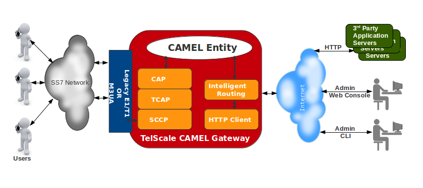

[[_design_overview]]
= Architecture

{this-platform} {this-application} is based on the robust and proven {this-platform} JAIN SLEE 1.1 Server and {this-platform} jSS7 Stack. 

{this-platform} JAIN SLEE Server is a highly scalable event-driven application server with a robust component model and fault tolerant execution environment.
It provides a set of connectors to a variety of networks elements like SS7 MAP, TCAP, INAP, ISUP, SMPP, XMPP, SIP, MGCP, HTTP, XDM, XCAP, Diameter and many others. {this-platform} JAIN SLEE Server is fully compliant with JSR 240 (JSLEE 1.1). 

{this-platform} jSS7 is a software based implementation of the SS7 protocol.
It provides implementation for Level 2 and above in the SS7 protocol Stack. {this-platform} jSS7 Stack User Guide is included in the product documentation for {this-platform} {this-application} .
We suggest that you refer to this guide for more details on the underlying jSS7 Stack. 

The diagram below depicts a high level design overview of {this-platform} {this-application} .

== Geographic Redundancy

{this-platform} {this-application} provides Load Balancing and Fault Tolerance.
You can pair two or more third-party Application Servers to provide Fault-Tolerance in the Gateway and GSM Network level. 

Geographic Redundancy can be achieved as shown in the diagram below:

[[_supported_protocols]]
== Protocols Supported for Proxy

As of now, the Gateway supports the following protocols for proxy: 

:leveloffset: +1

include::Section-Supported_CAP_Operations.adoc[]

:leveloffset: -1

:leveloffset: +1

include::Section-Multi_Tenancy.adoc[]

:leveloffset: -1
