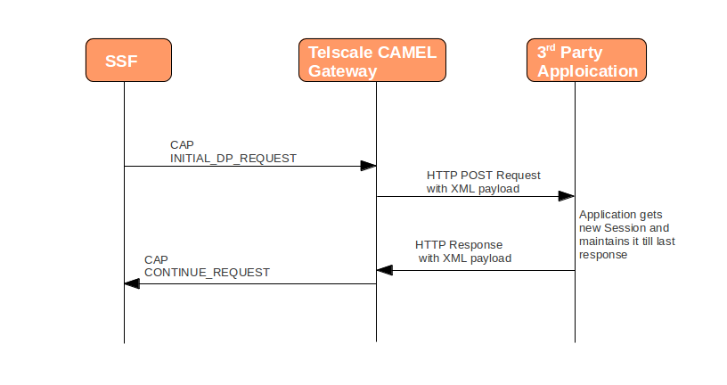

[[_http_architecture]]
= HTTP Transfer Mechanism

{this-application} supports implementation of HTTP 1.1 standards and acts as a HTTP Client invoking (HTTP POST) the HTTP Application deployed on the third-party Application Server.
The HTTP Request carries XML payload with CAP specific information.
 

The HTTP callback mechanism allows third-party applications to be developed independently of Operating System, Programming Language and Framework.
The third-party application can be either of the following technologies on any Operating System: 

* Apache Tomcat, JBoss AS, Oracle Application Server, IBM Websphere etc for JSP/Servlet on Java 
* PHP
* Microsoft IIS for ASP        

HTTP errors are supported and recognized by the {this-application} . 

[[_http_messages]]
== HTTP Message Structure

The diagram below depicts an example message sequence for interacting with {this-application} HTTP API.

[[_initial_dp_request]]
=== HTTP payload for INITIAL_DP_REQUEST

When the Gateway receives the 'INITIAL_DP_REQUEST' request, {this-application} will send an XML Payload to the third-party Application.
The XML structure will be as below: 

[source,xml]
----

<?xml version="1.0" encoding="UTF-8" ?>
<dialog type="Begin" appCntx="CapV2_gsmSSF_to_gsmSCF" localId="1" remoteId="1504012"
	 capMessagesSize="1" returnMessageOnError="false">
	<origAddress pc="2" ssn="146">
		<ai value="83"/>
		<gt type="GlobalTitle0100" tt="0" es="1" np="1" nai="4" digits="2222201"/>
	</origAddress>
	<destAddress pc="0" ssn="8">
		<ai value="18"/>
		<gt type="GlobalTitle0100" tt="0" es="1" np="1" nai="4" digits="1111112"/>
	</destAddress>
	<initialDP_Request invokeId="1" isCAPVersion3orLater="false">
		<serviceKey value="14"/>
		<calledPartyNumber>
			<isupCalledPartyNumber address="0782512817" natureOfAddresIndicator="3" 
				numberingPlanIndicator="1" internalNetworkNumberIndicator="0"/>
		</calledPartyNumber>
		<callingPartyNumber>
			<isupCallingPartyNumber address="93781202040" natureOfAddresIndicator="4" 
				numberingPlanIndicator="1" numberIncompleteIndicator="0" 
				addressRepresentationRestrictedIndicator="0" screeningIndicator="3"/>
		</callingPartyNumber>
		<callingPartysCategory>
			<isupCallingPartysCategory callingPartyCategory="10"/>
		</callingPartysCategory>
		<ipsspCapabilities/>
		<locationNumber>
			<isupLocationNumber address="937802" natureOfAddresIndicator="4" 
				numberingPlanIndicator="1" internalNetworkNumberIndicator="0" 
				addressRepresentationRestrictedIndicator="0" screeningIndicator="3"/>
		</locationNumber>
		<additionalCallingPartyNumber>
			<genericNumber address="93781202040" natureOfAddresIndicator="4" 
				numberingPlanIndicator="1" numberIncomplete="false" 
				addressRepresentationRestrictedIndicator="0" screeningIndicator="3" 
				numberQualifierIndicator="6"/>
		</additionalCallingPartyNumber>
		<bearerCapability>
			<bearerCap>
				<userServiceInformation codingStandart="0" informationTransferCapability="0" 
					transferMode="0" informationTransferRate="16" l1UserInformation="3" 
					syncMode="0" negotiation="0" userRate="0" intermediateRate="0" nicOnTx="0"
					 nicOnRx="0" fcOnTx="0" fcOnRx="0" hdr="0" multiframe="0" mode="0" lli="0" 
					 assignor="0" inBandNegotiation="0" stopBits="0" dataBits="0" parity="0" 
					 duplexMode="0" modemType="0"/>
			</bearerCap>
		</bearerCapability>
		<eventTypeBCSM value="termAttemptAuthorized"/>
		<imsi number="412500208832015"/>
		<subscriberState subscriberStateChoice="assumedIdle"/>
		<extBasicServiceCode>
			<extTeleservice>
				<teleserviceCodeValue value="17"/>
			</extTeleservice>
		</extBasicServiceCode>
		<callReferenceNumber>
			<data value="1605321A0155F2B2"/>
		</callReferenceNumber>
		<mscAddress number="93781090001" nai="international_number" npi="ISDN"/>
		<timeAndTimezone year="2013" month="4" day="17" hour="12" minute="31" 
			second="36" timeZone="18"/>
	</initialDP_Request>
</dialog>
----

The XML structure is similar to actual SS7 CAP messages.
The `<dialog>` tag acts as a parent tag.
 

The XML element `<dialog>` contains various attributes to represent the state and the parameters of the Dialog.
This section explains in detail all possible attributes and what they represent. 

type::
  This parameter specifies the type of TCAP message that has arrived at the CAMEL GW.
  The possible values for 'type' are: `Begin, End, Continue, Abort` or `Unknown.`.
  The initial message that comes from a CAMEL peer is `Begin`, The final message can be  `End` (normal Dialog end) or `Abort` (abnormal Dialog end).  `Continue` messages are used for message transfer without closing of Dialog. 

appCntx::
Represents the CAP Dialog Application Context.
Possible values are. 

* `CAP V1: CapV1_gsmSSF_to_gsmSCF`
* `CAP V2: CapV2_gsmSSF_to_gsmSCF, CapV2_gsmSRF_to_gsmSCF`
* `CAP V3: CapV3_gsmSSF_scfGeneric, CapV3_gsmSSF_scfAssistHandoff, CapV3_gsmSRF_gsmSCF, CapV3_gprsSSF_gsmSCF, CapV3_gsmSCF_gprsSSF, CapV3_cap3_sms`
* `CAP V4: CapV4_gsmSSF_scfGeneric, CapV4_gsmSSF_scfAssistHandoff, CapV4_scf_gsmSSFGeneric, CapV4_gsmSRF_gsmSCF, CapV4_cap4_sms`					

networkId::
  `netwrokId` is used for multi-tenancy support. {this-platform} {this-application}  can connect to multiple operators each differentiated by a `networkId`.
  The default value is 0.
  When a message reaches the Gateway, the SCCP Stack assigns a networkId.
  (For more details, please refer to the jSS7 Stack User Guide). The Gateway can route messages to different applications depending on the configured networkId routing rule. 

capMessagesSize::
  Represents the actual number of CAP messages carried in this XML Payload.
  This value can be 0 if no CAP messages are carried or 1 or more for multiple CAP messages.
  This is a mandatory parameter. 

origAddress and destAddress::
  SCCP Addresses representing the `CallingPartyAddress` and `CalledPartyAddress`. 

This is followed by the actual CAP message of the dialog.
 

All message types have a mandatory `invokeId` attribute helping to relate the response to the request.
 

[[_response_from_app]]
=== Payloads for requests / responses from third-party Application

When a third-party Application receives a HTTP Request  with an initial XML Payload, it must reply by sending a HTTP Response with an XML Payload to the gateway.
This payload will specify whether the gateway should end or continue the dialog.
It will also specify what other CAP components (Invokes, ReturnResult or Error message) will be sent to a peer.
The description below will help you to understand these payloads. 

* Empty message: Application can respond back to the Gateway such that it sends an empty TC-CONTINUE message to a peer, without ending the Dialog.
The Application needs to provide "capMessagesSize="0" attribute for <dialog> to specify that no CAP Invokes / Return response needs to be sent.
[source,xml]
----
<?xml version="1.0" encoding="UTF-8" ?>
	<dialog capMessagesSize="0">
</dialog>
----	 

* Empty TC-CONTINUE message (without CAP requests or error messages) will be sent only at a dialog intiating state.
If a dialog is already set and no CAP requests or error messages in HTTP payload then CAMEL GW will not send an empty TC-CONTINUE message to a peer.
If you do need to send an empty TC-CONTINUE in a dialog set step you need to add `sendEmptyContinue="true"` attribute
[source,xml]
----
<?xml version="1.0" encoding="UTF-8" ?>
	<dialog capMessagesSize="0" sendEmptyContinue="true">
</dialog>
----	 

* Empty message that will end the CAP Dialog: To end the dialog, the application needs to add a parameter `prearrangedEnd="false"`.
The Gateway will send an empty TC-END and close the Dialog. 
[source,xml]
----
<?xml version="1.0" encoding="UTF-8" ?>
	<dialog capMessagesSize="0" prearrangedEnd="false">
</dialog>
----	 
* Sending CAP Invokes / ReturnResult components: Below is an example with two Invokes that will be sent to a peer (without ending the CAP Dialog). The Application needs to specify the parameter `capMessagesSize` to the count of operations to send.
In this payload, there are two components (Invokes) - `continue_Request` and `releaseCall_Request`.
The templates for payload will be provided in the subsequent chapters. 
[source,xml]
----

										
<?xml version="1.0" encoding="UTF-8" ?>
<dialog capMessagesSize="2" invokeWithoutAnswerIds="1">
	<continue_Request/>
	<releaseCall_Request>
		<cause>
			<isupCauseIndicators location="4" causeValue="16" codingStandard="0" recommendation="0"/>
		</cause>
	</releaseCall_Request>
</dialog>
----	 

It is required to include the `invokeId` parameter in the payload, if the application is sending a `ReturnResult` component.
The value of `invokeId` should be same as that received from the original Invoke request.
 
It is not required to include the `invokeId` parameter in the payload, if the application is sending a new Invoke component.
The Gateway will automatically assign `invokeId` values to Invoke request sent by Application.
The Application will get the assigned `invokeId` values from the next HTTP request sent by the CAMEL GW (The remark: this HTTP request will occur only when you configure "camel set updateassignedinvokeids" to true - <<_setting_camel_updateassignedinvokeids>>). This request will contain `assignedInvokeIds` parameter with assigned `invokeId` values (with comma separator) for sent Invoke components, in the order they have been sent.
Below is an example of such a request from the Gateway. 
[source,xml]
----

										
<?xml version="1.0" encoding="UTF-8" ?>
<dialog type="Begin" appCntx="CapV4_gsmSSF_scfGeneric" networkId="11" localId="1" 
	remoteId="1" assignedInvokeIds="1,2" capMessagesSize="0" returnMessageOnError="false">
	<origAddress pc="2" ssn="146">
		<ai value="83"/>
		<gt type="GlobalTitle0100" tt="0" es="1" np="1" nai="4" digits="2222201"/>
	</origAddress>
	<destAddress pc="0" ssn="8">
		<ai value="18"/>
		<gt type="GlobalTitle0100" tt="0" es="1" np="1" nai="4" digits="1111112"/>
	</destAddress>
</dialog>
----									                              

* Sending CAP Error components: Below is an example showing how to send CAP Error components for Invokes received by the Application from the Gateway.
It is mandatory to include the `invokeId` parameter. 
[source,xml]
----

										
<?xml version="1.0" encoding="UTF-8" ?>
<dialog capMessagesSize="0" invokeWithoutAnswerIds="1">
	<errComponents>
		<invokeId value="1"/>
		<errorComponent type="CAPErrorMessageSystemFailure" errorCode="11">
			<unavailableNetworkResource value="endUserFailure"/>
		</errorComponent>
		<invokeId value="2"/>
		<errorComponent type="CAPErrorMessageParameterless" errorCode="4"/>
	</errComponents>
</dialog>
----	 
* Aborting Dialog : The Application can abort a dialog and the Gateway will send a TC-ABORT message to peer as shown in the example below. 
[source,xml]
----

										
<?xml version="1.0" encoding="UTF-8" ?>
	<dialog capMessagesSize="0" capUserAbortReason="application_timer_expired">
	</dialog>
----	 

In this case, `capUserAbortReason` can be `no_reason_given`,  `application_timer_expired`, `not_allowed_procedures`, `abnormal_processing`,  `congestion`, `invalid_reference`,  `missing_reference` or `overlapping_dialogue`. 

* `invokeWithoutAnswerIds`: When a third party application receives CAP Invoke components, it must decide how to respond to these Invoke components.
  For certain Invokes, `ReturnResults` are needed, for some others it is needed to send Error components as a response.
  In this case the CAP application should add components into a payload. 
+
For most cases, no responses are needed.
In such cases, the third party application should inform the Gateway that it will not respond to Invoke components (with a list of invokeIds as comma separated values). This can be achieved using the parameter `invokeWithoutAnswerIds`.
 
+
The example below shows the template for two such Invoke components with `invokeId` values 1 and 2. 
[source,xml]
----

										
<?xml version="1.0" encoding="UTF-8" ?>
<dialog capMessagesSize="1" invokeWithoutAnswerIds="1,2">
	<continue_Request/>
	<releaseCall_Request>
	</releaseCall_Request>
</dialog>
----	 
							 

[[_continue_request]]
==== HTTP payload for CONTINUE_REQUEST

In order to send a `CONTINUE_REQUEST` to the Gateway, the third party Application must provide the below XML Payload. 

[source,xml]
----

		
	<?xml version="1.0" encoding="UTF-8" ?>
	<dialog ...>
		...
		<continue_Request/>
		...
	</dialog>
----

[[_connect_request]]
==== HTTP payload for CONNECT_REQUEST

In order to send a `CONNECT_REQUEST` to the Gateway, the third party Application must provide the below XML Payload. 

[source,xml]
----

		
	<?xml version="1.0" encoding="UTF-8" ?>
	<dialog ....>
		....
		<connect_Request>
			<destinationRoutingAddress>
				<calledPartyNumberList>
					<calledPartyNumber>
						<isupCalledPartyNumber address="923335340951" natureOfAddresIndicator="2" 
							numberingPlanIndicator="1" internalNetworkNumberIndicator="0" />
					</calledPartyNumber>
				</calledPartyNumberList>
			</destinationRoutingAddress>
		</connect_Request>
	</dialog>
----

XML Payload for full `CONNECT_REQUEST` is as below: 

[source,xml]
----

		
	<?xml version="1.0" encoding="UTF-8" ?>
	<dialog ....>
		....
		<connect_Request>
			<destinationRoutingAddress>
			<calledPartyNumberList>
				<calledPartyNumber>
					<isupCalledPartyNumber address="111111111111" natureOfAddresIndicator="2" 
						numberingPlanIndicator="1" internalNetworkNumberIndicator="0" />
				</calledPartyNumber>
			</calledPartyNumberList>
			</destinationRoutingAddress>
			<alertingPattern>
				<alertingPattern alertingCategory="Category5"/>
			</alertingPattern>
			<originalCalledPartyID>
				<isupOriginalCalledNumber address="7010900" natureOfAddresIndicator="3" 
					numberingPlanIndicator="1" addressRepresentationRestrictedIndicator="1"/>
			</originalCalledPartyID>
			<carrier data="0B0C0D0E"/>
			<callingPartysCategory>
				<isupCallingPartysCategory callingPartyCategory="10"/>
			</callingPartysCategory>
			<redirectingPartyID>
				<isupRedirectingNumber address="7010900" natureOfAddresIndicator="3" 
					numberingPlanIndicator="1" addressRepresentationRestrictedIndicator="1"/>
			</redirectingPartyID>
			<redirectionInformation>
				<isupRedirectionInformation redirectingIndicator="3" 
					originalRedirectionReason="0" redirectionCounter="1" redirectionReason="6"/>
			</redirectionInformation>
			<genericNumbersList>
				<genericNumber>
					<genericNumber address="40" natureOfAddresIndicator="2" numberingPlanIndicator="0" 
						numberIncomplete="false" addressRepresentationRestrictedIndicator="0" 
						screeningIndicator="3" numberQualifierIndicator="1"/>
				</genericNumber>
			</genericNumbersList>
			<serviceInteractionIndicatorsTwo>
				<nonCUGCall value="false"/>
				<forwardServiceInteractionInd>
					<conferenceTreatmentIndicator value="rejectConferenceRequest"/>
				</forwardServiceInteractionInd>
			</serviceInteractionIndicatorsTwo>
			<chargeNumber>
				<isupLocationNumber address="0000077777" natureOfAddresIndicator="4" 
					numberingPlanIndicator="0" internalNetworkNumberIndicator="0" 
					addressRepresentationRestrictedIndicator="0" screeningIndicator="0"/>
			</chargeNumber>
			<legToBeConnected sendingSideID="leg5"/>
			<cugInterlock data="15161718"/>
			<cugOutgoingAccess value="true"/>
			<suppressionOfAnnouncement value="true"/>
			<OCSIApplicable value="true"/>
			<NAOliInfo value="40"/>
			<borInterrogationRequested value="true"/>
		</connect_Request>
	</dialog>
----

[[_release_call_request]]
==== HTTP payload for RELEASE_CALL_REQUEST

In order to send a `RELEASE_CALL_REQUEST` to the Gateway, the third party Application must provide the below XML Payload. 

[source,xml]
----

		
	<?xml version="1.0" encoding="UTF-8" ?>
	<dialog ...>
		....
		<releaseCall_Request>
			<cause>
				<isupCauseIndicators location="4" causeValue="16" codingStandard="0" 
					recommendation="0"/>
			</cause>
		</releaseCall_Request>		
	</dialog>
----

[[_request_report_bcsm_event_request]]
==== HTTP payload for REQUEST_REPORT_BCSM_EVENT_REQUEST

In order to send a `REQUEST_REPORT_BCSM_EVENT_REQUEST` to the Gateway, the third party Application must provide the below XML Payload. 

[source,xml]
----

		
	<?xml version="1.0" encoding="UTF-8" ?>
	<dialog ...>
		....
		<requestReportBCSMEvent_Request>
			<bcsmEventList>
				<bcsmEvent>
					<eventTypeBCSM value="routeSelectFailure"/>
					<monitorMode value="interrupted"/>
					<legID sendingSideID="leg2"/>
				</bcsmEvent>
				<bcsmEvent>
					<eventTypeBCSM value="oCalledPartyBusy"/>
					<monitorMode value="interrupted"/>
					<legID sendingSideID="leg2"/>
				</bcsmEvent>
				<bcsmEvent>
					<eventTypeBCSM value="oNoAnswer"/>
					<monitorMode value="interrupted"/>
					<legID sendingSideID="leg2"/>
				</bcsmEvent>
				<bcsmEvent>
					<eventTypeBCSM value="oAnswer"/>
					<monitorMode value="notifyAndContinue"/>
					<legID sendingSideID="leg2"/>
				</bcsmEvent>
				<bcsmEvent>
					<eventTypeBCSM value="oDisconnect"/>
					<monitorMode value="interrupted"/>
					<legID sendingSideID="leg1"/>
				</bcsmEvent>
				<bcsmEvent>
					<eventTypeBCSM value="oDisconnect"/>
					<monitorMode value="interrupted"/>
					<legID sendingSideID="leg2"/>
				</bcsmEvent>
				<bcsmEvent>
					<eventTypeBCSM value="oAbandon"/>
					<monitorMode value="notifyAndContinue"/>
					<legID sendingSideID="leg1"/>
				</bcsmEvent>
			</bcsmEventList>
		</requestReportBCSMEvent_Request>		
	</dialog>
----

[[_apply_charging_request]]
==== HTTP payload for APPLY_CHARGING_REQUEST

In order to send a `APPLY_CHARGING_REQUEST` to the Gateway, the third party Application must provide the below XML Payload. 

[source,xml]
----

		
	<?xml version="1.0" encoding="UTF-8" ?>
	<dialog ...>
		....
		<applyCharging_Request>
			<aChBillingChargingCharacteristics>
				<maxCallPeriodDuration value="36000"/>
				<releaseIfdurationExceeded value="false"/>
			</aChBillingChargingCharacteristics>
			<partyToCharge>
				<sendingSideID value="1"/>
			</partyToCharge>
			<aChChargingAddress>
				<srfConnection value="10"/>
			</aChChargingAddress>
		</applyCharging_Request>		
	</dialog>
----

[[_cancel_request]]
==== HTTP payload for CANCEL_REQUEST

In order to send a `CANCEL_REQUEST` to the Gateway, the third party Application must provide the below XML Payload.
All 3 possible CANCEL_REQUEST formats are presented below. 

[source,xml]
----

		
	<?xml version="1.0" encoding="UTF-8" ?>
	<dialog ...>
		....
		<cancel_Request>
			<invokeID value="11000"/>
		</cancel_Request>
		<cancel_Request>
			<callSegmentToCancel>
				<callSegmentID value="20"/>
			</callSegmentToCancel>
		</cancel_Request>
		<cancel_Request>
			<allRequests value="true"/>
		</cancel_Request>
	</dialog>
----

[[_response_to_app]]
=== Payloads for requests / responses to the third-party Application

The {this-application} can send payloads other than INITIAL_DP_REQUEST to the third-party application as shown in the below examples. 

Payload that contains CAP Error and Reject components from a peer::

[source,xml]
----

										
<?xml version="1.0" encoding="UTF-8" ?>
<dialog type="Continue" appCntx="CapV4_gsmSSF_scfGeneric" networkId="11" 
	localId="12" remoteId="13" assignedInvokeIds="1" capMessagesSize="0" 
	returnMessageOnError="false">
	<origAddress pc="2" ssn="146">
		<ai value="83"/>
		<gt type="GlobalTitle0100" tt="0" es="1" np="1" nai="4" digits="2222201"/>
	</origAddress>
	<destAddress pc="0" ssn="8">
		<ai value="18"/>
		<gt type="GlobalTitle0100" tt="0" es="1" np="1" nai="4" digits="1111112"/>
	</destAddress>
	<errComponents>
		<invokeId value="1"/>
		<errorComponent type="CAPErrorMessageSystemFailure" errorCode="11">
			<unavailableNetworkResource value="endUserFailure"/>
		</errorComponent>
		<invokeId value="2"/>
		<errorComponent type="CAPErrorMessageParameterless" errorCode="4"/>
		</errComponents>
	<rejectComponents>
		<invokeId value="1"/>
		<rejectComponent problemType="ReturnError">
			<problemReturnError value="UnrecognizedInvokeID"/>
		</rejectComponent>
	</rejectComponents>
</dialog>
----	 

TC-USER-ABORT message from a peer that breaks the CAP Dialog::

[source,xml]
----

										
<?xml version="1.0" encoding="UTF-8" ?>
<dialog type="Abort" appCntx="CapV4_gsmSSF_scfGeneric" networkId="11" localId="1" 
	remoteId="1" capMessagesSize="0" capUserAbortReason="application_timer_expired" 
	returnMessageOnError="false">
	<origAddress pc="2" ssn="146">
		<ai value="83"/>
		<gt type="GlobalTitle0100" tt="0" es="1" np="1" nai="4" digits="2222201"/>
	</origAddress>
	<destAddress pc="0" ssn="8">
		<ai value="18"/>
		<gt type="GlobalTitle0100" tt="0" es="1" np="1" nai="4" digits="1111112"/>
	</destAddress>
</dialog>
----	 							 

Templates for CAP primitives that can come from a SS7 peer are covered in the subsequent sections of this document. 

[[_initial_dp_request_from_peer]]
==== Payload for INITIAL_DP_REQUEST Invoke from a SS7 peer

INITIAL_DP_REQUEST is a complicated operation.
The templates below describe 3 possible payloads for this operation. 

[source,xml]
----

		
	<?xml version="1.0" encoding="UTF-8" ?>
	<dialog ...>
		...
		<initialDP_Request invokeId="24" isCAPVersion3orLater="false">
			<serviceKey value="110"/>
			<calledPartyNumber>
				<isupCalledPartyNumber address="12270109000" natureOfAddresIndicator="3" 
					numberingPlanIndicator="1" internalNetworkNumberIndicator="1"/>
			</calledPartyNumber>
			<callingPartyNumber>
				<isupCallingPartyNumber address="75" natureOfAddresIndicator="3" 
					numberingPlanIndicator="1" numberIncompleteIndicator="1" 
					addressRepresentationRestrictedIndicator="1" screeningIndicator="3"/>
			</callingPartyNumber>
			<callingPartysCategory>
				<isupCallingPartysCategory callingPartyCategory="10"/>
			</callingPartysCategory>
			<cgEncountered value="manualCGencountered"/>
			<ipsspCapabilities ipRoutingAddressSupported="true" voiceBackSupported="true" 
				generationOfVoiceAnnouncementsFromTextSupported="true"/>
			<locationNumber>
				<isupLocationNumber address="12345333111" natureOfAddresIndicator="3" 
					numberingPlanIndicator="4" internalNetworkNumberIndicator="1" 
					addressRepresentationRestrictedIndicator="0" screeningIndicator="1"/>
			</locationNumber>
			<originalCalledPartyID>
				<isupOriginalCalledNumber address="7010900" natureOfAddresIndicator="3" 
					numberingPlanIndicator="1" addressRepresentationRestrictedIndicator="1"/>
			</originalCalledPartyID>
			<extensions>
				<extensionFieldList>
					<extensionField localCode="2" criticalityType="typeIgnore">
						<data value=""/>
					</extensionField>
					<extensionField localCode="3" criticalityType="typeAbort">
						<data value="FF"/>
					</extensionField>
				</extensionFieldList>
			</extensions>
			<highLayerCompatibility>
				<isupUserTeleserviceInformation codingStandard="2" interpretation="4" 
					presentationMethod="1" highLayerCharIdentification="51"/>
			</highLayerCompatibility>
			<additionalCallingPartyNumber>
				<genericNumber address="12345" natureOfAddresIndicator="3" 
					numberingPlanIndicator="4" numberIncomplete="true" 
					addressRepresentationRestrictedIndicator="0" screeningIndicator="2" 
					numberQualifierIndicator="5"/>
			</additionalCallingPartyNumber>
			<bearerCapability>
				<bearerCap>
					<userServiceInformation codingStandart="1" informationTransferCapability="24" 
						transferMode="2" informationTransferRate="17"/>
				</bearerCap>
			</bearerCapability>
			<eventTypeBCSM value="collectedInfo"/>
			<redirectingPartyID>
				<isupRedirectingNumber address="7010900" natureOfAddresIndicator="3" 
					numberingPlanIndicator="1" addressRepresentationRestrictedIndicator="1"/>
			</redirectingPartyID>
			<redirectionInformation>
				<isupRedirectionInformation redirectingIndicator="3" originalRedirectionReason="0" 
					redirectionCounter="1" redirectionReason="6"/>
			</redirectionInformation>
			<imsi number="607029900140199"/>
			<subscriberState subscriberStateChoice="notProvidedFromVLR"/>
			<locationInformation>
				<ageOfLocationInformation value="111"/>
			</locationInformation>
			<extBasicServiceCode>
				<extTeleservice teleserviceCodeValue="telephony"/>
			</extBasicServiceCode>
			<callReferenceNumber>
				<data value="13FA3D3DEA"/>
			</callReferenceNumber>
			<mscAddress number="2207750007" nai="international_number" npi="ISDN"/>
			<calledPartyBCDNumber number="41788005047" nai="international_number" npi="ISDN"/>
			<timeAndTimezone year="2005" month="11" day="24" hour="13" minute="10" second="56" 
				timeZone="0"/>
			<callForwardingSSPending value="true"/>
			<initialDPArgExtension isCAPVersion3orLater="false">
				<gmscAddress number="2207750007" nai="international_number" npi="ISDN"/>
			</initialDPArgExtension>
		</initialDP_Request>
	</dialog>
----

[source,xml]
----

		
	<?xml version="1.0" encoding="UTF-8" ?>
	<dialog ...>
		...
		<initialDP_Request invokeId="24" isCAPVersion3orLater="false">
			<serviceKey value="110"/>
			<calledPartyNumber>
				<isupCalledPartyNumber address="12270109000" natureOfAddresIndicator="3" 
					numberingPlanIndicator="1" internalNetworkNumberIndicator="1"/>
			</calledPartyNumber>
		</initialDP_Request>
	</dialog>
----

[source,xml]
----

		
	<?xml version="1.0" encoding="UTF-8" ?>
	<dialog ...>
		...
		<initialDP_Request invokeId="12" isCAPVersion3orLater="false">
			<serviceKey value="110"/>
			<calledPartyNumber>
				<isupCalledPartyNumber address="1111222266" natureOfAddresIndicator="4" 
					numberingPlanIndicator="1" internalNetworkNumberIndicator="0"/>
			</calledPartyNumber>
			<cgEncountered value="scpOverload"/>
			<cause>
				<isupCauseIndicators location="4" causeValue="58" codingStandard="2" 
					recommendation="0"/>
			</cause>
			<serviceInteractionIndicatorsTwo>
				<nonCUGCall value="false"/>
				<holdTreatmentIndicator value="rejectHoldRequest"/>
			</serviceInteractionIndicatorsTwo>
			<carrier data="01020304"/>
			<cugIndex>
				<value value="211"/>
			</cugIndex>
			<cugInterlock data="0B0C0D0E"/>
			<cugOutgoingAccess value="true"/>
		</initialDP_Request>
	</dialog>
----

[[_event_report_bcsm_request_from_peer]]
==== Payload for EVENT_REPORT_BCSM_REQUEST Invoke from a SS7 peer

[source,xml]
----

		
	<?xml version="1.0" encoding="UTF-8" ?>
	<dialog ...>
		...
		<eventReportBCSM_Request invokeId="24">
			<eventTypeBCSM value="routeSelectFailure"/>
			<eventSpecificInformationBCSM>
				<routeSelectFailureSpecificInfo>
					<causeCap>
						<isupCauseIndicators location="4" causeValue="16" codingStandard="0" recommendation="0"/>
					</causeCap>
				</routeSelectFailureSpecificInfo>
			</eventSpecificInformationBCSM>
			<legID>
				<receivingSideID value="2"/>
			</legID>
			<miscCallInfo>
				<messageType value="0"/>
			</miscCallInfo>
		</eventReportBCSM_Request>
	</dialog>
----

[[_apply_charging_report_request_from_peer]]
==== Payload for APPLY_CHARGING_REPORT_REQUEST Invoke from a SS7 peer

[source,xml]
----

		
	<?xml version="1.0" encoding="UTF-8" ?>
	<dialog ...>
		...
		<applyChargingReport_Request invokeId="24">
			<timeDurationChargingResult>
			<partyToCharge>
				<receivingSideID value="1"/>
			</partyToCharge>
			<timeInformation>
				<timeIfNoTariffSwitch value="26"/>
			</timeInformation>
			</timeDurationChargingResult>
		</applyChargingReport_Request>
	</dialog>
----

[[_prompt_and_collect_user_information_response_from_peer]]
==== Payload for PROMPT_AND_COLLECT_USER_INFORMATION_RESPONSE ReturnResultLast from a SS7 peer

[source,xml]
----

		
	<promptAndCollectUserInformation_Response invokeId="21">
	<digitsResponse>
	<genericNumber address="987" natureOfAddresIndicator="1" numberingPlanIndicator="2" numberIncomplete="true"
	addressRepresentationRestrictedIndicator="3" screeningIndicator="0" numberQualifierIndicator="0"/>
	</digitsResponse>
	</promptAndCollectUserInformation_Response>
----

[[_no_activity_call]]
==== No Acivity Timeout Call

If there is no activity for noactivitytimeout period in seconds, &THIS.PLATFORM;will send <dialog> with attribute  `noActivityTimeOut` set to true indicating there is no activity.
Application can take necessary action, for example either end Dialog or send empty response for Dialog to continue.
 

[source,xml]
----

		
	<?xml version="1.0" encoding="UTF-8" ?>
<dialog type="Continue" appCntx="CapV1_gsmSSF_to_gsmSCF" networkId="0" localId="1" remoteId="9"
	 capMessagesSize="0" noActivityTimeOut="true" returnMessageOnError="false">
...
</dialog>
----
