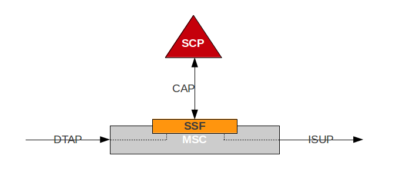

= Overview 

[[_camel_overview]]
== CAMEL

CAMEL stands for Customized Applications for Mobile networks Enhanced Logic.
It is a set of standards designed to work on either a GSM core network or on a UMTS network.
CAMEL allows an operator to define services over standard GSM services/UMTS services.
The CAMEL architecture is based on the Intelligent network (IN) standards,  and uses the CAP protocol. 

Many services can be created using CAMEL, especially, services relating to roaming subscribers.
The list below is an example of some of these services: 

Virtual Private Network (VPN):::
  CAMEL enables a mobile VPN that simulates PBX-like dialing in a mobile environment.
  For example, a subscriber can dial "9901" and the call will be send to user Amit Bhayani at 996063-9901. 

Call Redirect Services (CRS):::
  CAMEL is utilized to provide a variety of CRS services including redirecting international roaming subscribers to their desired customer care when they dial "`123`" 

Conditional Call Forwarding:::
  Calls can be forwarded to another subscriber if the called party is busy or not available.
  You also have to option to perform unconditional calls.
   

SMS:::
  CAMEL also allows you to fine-tune SMS and billing       		 

== CAMEL Entities

The main entities involved in CAMEL are 

Service Switching Function (SSF):::
  The IN control protocol at the exchange is handled by the service switching function (SSF). The SSF passes call control from the exchange to the SCP and relays instructions from the SCP back to the exchange.
  All IN protocol aspects are handled by the SSF.
  Figure below depicts the SSF in an MSC. 

Service Control Function (SCF):::
  The service control function (SCF) is the functional entity residing in the service control plane (SCP). It forms an application  in the SCP that facilitates the execution of IN services.
  The SCP is an addressable node in the SS7 network.
  Other nodes in the network may communicate with the SCP through the SS7 signaling protocol.    		   

For example a subscriber may dial *#122# to reach a specific USSD service which is deployed in the home network.
The application may reply with a menu based on the dialed short code.
One of the advantages of this service is that it is always available even when the subscriber is roaming. 

[[_camel_gateway_desc]]
== CAMEL Gateway

{this-platform} {this-application} forms part of SCF. {this-platform} {this-application} maintains the CAP Dialog and state modal, however it forwards the received CAP request over HTTP as XML payload  to configured Application. 

The application handles business logic and responds with a corresponding CAP message.
The diagram below shows all the nodes involved 

image::images/Restcomm-camel-gw.png[]

[[_restcomm_camel_overview]]
== Major Features of {this-platform} {this-application} 

{this-platform} 's implementation of CAMEL Gateway is the first and only open source CAMEL Gateway with a host of rich features and advantages. 

Java-based:::
  {this-platform} {this-application} is the only Java based CAMEL Gateway.
  It is robust, reliable and can be installed on any Operating System that supports Java (JDK 7 and SCTP). 

Open Source:::
  The Software is open-source, therefore, you get access to the source code and you also have the added value of being able to customize its features to your enterprise needs.
  Additionally, there is an active community providing product support. 

SS7 Hardware Cards:::
  {this-platform} {this-application} can be used with {this-platform} SS7 boards or Intel family boards (Dialogic SS7 cards) or Zaptel/Dahdi compatible TDM devices (Digium, Sangoma). 

SIGTRAN (M3UA):::
  It also has in-built support for SIGTRAN (M3UA using SCTP). 

Easy Configuration and Management:::
{this-platform} {this-application} comes with an efficient Command Line Interface (CLI) tool allowing you to easily configure the gateway at run-time and manage it using simple intuitive commands. 

  * {this-platform} {this-application} is easily scalable with a configurable load-balancing and high available architecture.        

Technical Specifications:::
{this-platform} {this-application} is not restricted by any license or Transaction Per Second model.
The only restricting factor is memory + CPU capacity of the host servers, third-party applications or the underlying database service. 

* {this-platform} {this-application} supports as many as 1,073,741,823 incoming and 1,073,741,823 outgoing concurrent sessions/dialogs.
* {this-platform} {this-application} supports unlimited E1 links and the only limiting factor is the underlying TDM board used.
* {this-platform} {this-application} SCTP supports as many associations as supported by the underlying Operating System.
* {this-platform} {this-application} M3UA can be configured to have as many ASP's / IPSP's as needed by the system.
  * {this-platform} {this-application} SCCP can be configured to have virtually unlimited Global Title Translation rules and also supports wild characters for partial matching of Global Title digits.        

HTTP Transfer Mechanism:::
The {this-platform} {this-application} makes use of HTTP protocol between the gateway and the third-party applications. {this-platform} {this-application} receives CAMEL request from the GSM Signaling network and then translates these requests to HTTP.
The third-party application can be either of the following technologies on any Operating System: 

* Apache Tomcat, JBoss AS, Oracle Application Server, IBM Websphere etc for JSP/Servlet on Java 
* PHP
* Microsoft IIS for ASP        

Multi tenancy support:::
  Same instance of {this-platform} {this-application} can connect to different operators (MNO) and request from each can be directed to corresponding Application.
  For further details refer to <<_design_multitenancy>>      
