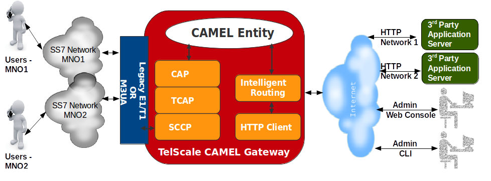

[[_design_multitenancy]]
= Multi tenancy support

Multi tenancy allows a single instance of {this-platform} {this-application} to connect to different operators, with each connection having its own links and point-codes. 

{this-platform} {this-application} achieves Multi tenancy by splitting a model of SS7 network into several logical networks.
Each logical network has a corresponding digital key called `"networkId"` with a default value of 0 (unless specified differently). For every `"networkId"`, you can specify a corresponding HTTP Application to separate the business logic for each network.
 

NOTE: If you would like to get more details about setting up Multi tenancy at jSS7, please refer to the Restcomm jSS7 Admin Guide. 

The diagram below depicts the high level design for Multi tenancy support in {this-platform} {this-application} . 

